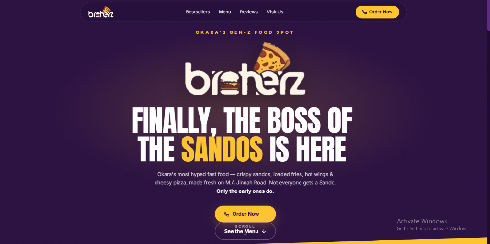

# Brotherz Pk — Restaurant Commercial Landing Page

[](https://github.com/aayansheraz/brotherz-website/actions/workflows/ci.yml)
[](https://aayansheraz.github.io/brotherz-website/)
[](https://react.dev/)
[](https://www.typescriptlang.org/)
[](https://tailwindcss.com/)

**[🚀 View Live Commercial Restaurant Web App →](https://aayansheraz.github.io/brotherz-website/)**



A high-converting scroll-animated commercial website built for **Brotherz Pk**, a restaurant in Okara. Features an interactive hero carousel, bestseller showcase grid, interactive menu tabs, and location / contact info routing.

Built with **React + TypeScript + Vite + Tailwind CSS v4 + Lucide Icons**.

---

## 🌟 Key Features

- **Hero Interactive Carousel:** Full-width animated carousel showcasing featured dining specials.
- **Bestsellers Showcase:** Dynamic item cards with 3D Microsoft Fluent vector assets.
- **Categorized Menu System:** Modular menu configuration stored in `src/data/menu.ts`.
- **Automated CI/CD:** GitHub Action build verification pipeline ensuring reliable static deployments.

---

## 💻 Local Development Setup

```bash
# Install dependencies
npm install

# Run local development server
npm run dev
```

---

## 📦 Production Build

```bash
npm run build
```

---

## 📄 License

This project is licensed under the MIT License - see the [LICENSE](LICENSE) file for details.
